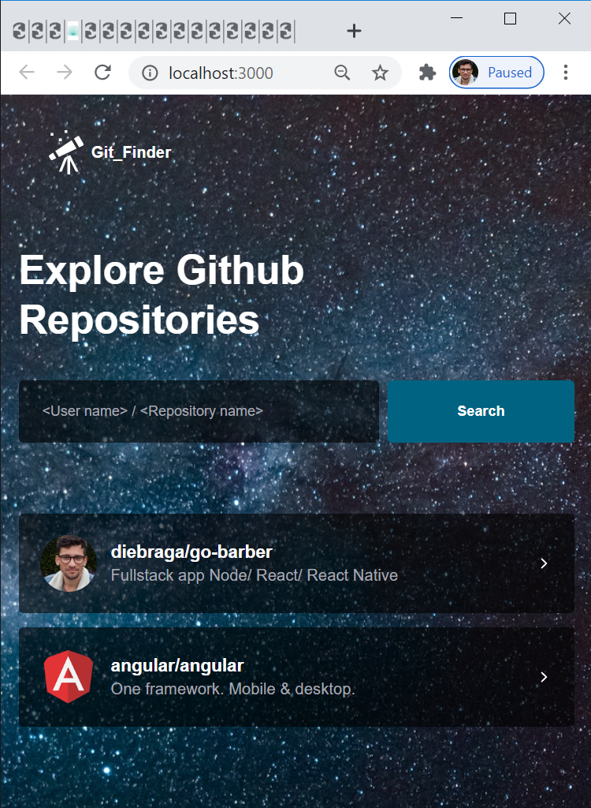

# Git_Finder

The app connects to Github Api, finding repositories
and listing their Issues.

  

 
## UX
 
  The App consists in a `dashboard` page where useres can input author and repository in order to find
  repositories "the place holder is easy explaining" the design is very intuitive making it 
  very user friendly, once found the repo can be clicked directing the user to another page.
  
  The page `repository` lists all issues in the repository found clicking in them the user will
  bne dfirect to tha issues page, the page displays the number of forks, stars and issues in repo.
  
  Both pages displays Repository description, and profile.
  
  all the app is made thinking about the user experience, easy navigation, harmony colors and design,
  the app is following the best pratices in design software aiming, code maintenance, growth and better reading.
  
## Wireframe Mockups

Following the link:

https://www.figma.com/file/Hfvqx2xRxkxi8AeOBlzdPS/Untitled?node-id=0%3A1

app view: 

 

## Features

- Dashboard page "/" You can search for repositories through git hub
typing ex: <User> / <Repository_name> if found it will be displayed in the page.

- Repositorie page "/repositories" clicking in the reposigory desidered 
you will be directed to repositories page where are displayed all issues
in the repositories clicking in thedm you're redirected to the issue's github
page.

## Technologies 

- [Yarn](https://yarnpkg.com/pt-BR/docs/install)

- 📗 **ReactJs** — A JavaScript library for building user interfaces
- 📕 **styled-components** — Library transforms css in Components.
- 📙 **react-icons** — SVG React icons of popular icon packs using ES6 imports.
- 📒 **react-router-dom** — Library allows easy navigation in the app.
- 📘 **polished** - A lightweight toolset for writing styles in JavaScript.
- ✅ **Lint** — ESlint/Prettier/Editor Config. 
- ☑️ **Typescrit** — TypeScript is a typed superset of JavaScript that compiles to plain JavaScript. 
- 🔡 **Jest** — JavaScript Testing Framework. 

## libraries
<pre>
* Typescrit:  it's a superset tool to type javascript typing your elements
in the app you can easy indentify the properties elements specially when the application is
getting big, it allows you to create interfaces to type your components with the params
that you want inside the components and much more... behind the scenes it compiles
your code in pure javascript wich will make sure it's gonna run in other browsers.
https://www.typescriptlang.org/

* Styled Components:  it's a CSS library that allow us to wrap all CSS styles in
a `var` that can be exported to our HTML pages as a react component. Syntax EX:

import styled from 'styled-components';                  import React from 'react';
                                                         
export const Container = styled.div`         **=>**      import { Container } from '../../_styles_css/explore/styles';
  p {                                                    
    font-weight: bold;                                   const HelloWorld: React.FC = () => {
    }                                                     return (
`;                                                          <Container>
                                                              **ReactJs**
                                                            </Container>
                                                           );
                                                         };
                                                         
                                                         export default HelloWorld;

For each element wrapped inside <Container> which is already an HTML tag in this case a `div` 
styled components already creates a unique class wich makes it way easy to work on, isolating 
the elements that you wanna apply styles.
https://styled-components.com/

* Polished: Polished is a mini library that allows the easy implementation of javascript code 
in css like conditionals, easy hovers, get html params etc... example syntax:

const styles = {
  color: '#333',
  "font-size": '1.33em',
  '@media only screen and (-webkit-min-device-pixel-ratio: 1.5), only screen and (min--moz-device-pixel-ratio: 1.5),
  only screen and (-o-min-device-pixel-ratio: 1.5/1), only screen and (min-resolution: 144dpi),
  only screen and (min-resolution: 1.5dppx)': {
    "font-size": '1.66625em',
  }
  https://polished.js.org/
  
* Jest:  it's a testing library that helps you to write tests in your application in a fast and
easy way.
https://jestjs.io/
</pre>
   
## Testing
    
    Usability Testing.
    **Verify the app cability of add repository when called using jest**
    1. Go in the project folder `Exploring-git` and run: `yarn test` or `npm test` in your terminal.
      
    √ should be able to add repo.
    
    It verifies when the input is filled and you pres the Search button,
    repository exists after the click.
    https://testing-library.com/docs/react-testing-library/intro
   <pre>
   
   Functionality Testing.
   Route Links in the app are mocked and manually tested you can free navigate in the application.
   
   The only link in the app to an external page is working perfectly and target blank.
  
   Compatibility Testing.
   I tested the app manually on a variaty of browsers:
   
   Chrome
   Brave
   Edge
   FireFox
   
   and mobile:
   
   Iphone 10
   Sansung Galaxy S7
   
   Performance Testing.
   and different screen sizes using the inspector.
   criteria: responsivity, fluidity, design, sizes functionality behavior.
   
Form:
JavaScript validation     
If validation ensure if the value in the input is valid
or null and returns an error message in the frontend and backend.

ESlint: Tool that verify automatcally your JS code, preventing,
fixing and reporting syntax errors, integrated with prettier
will ensure a beautifull and good style guid for better reading  
preventing errors.
To verify the rules and settings apllied in the project go on: 
exploring-git `route directory`
/eslintrc.json
/prettier.config.js

https://eslint.org/
https://prettier.io/
           </pre>

## Structure

<pre>
Under `exploring-git/src` you gonna find all the project's code source.

Under `exploring-git/src/__tests__` you gonna find unit tests for the app fuctionalitie jest framework.
Under `itinterprises/src/_assets` you gonna find all media content used in the app.
Under `exploring-git/src/_assets` you gonna find all media content used in the app.

Under `exploring-git/src/_styles_css` you gonna find all the CSS content for each page separated in folders in the app.
Under `exploring-git/src/pages` you gonna find all the HTML content in the app.
Under `exploring-git/src/styles` you gonna find the global CSS content for all the app.

Under `exploring-git/src/routes` you gonna find all routes to navigate in the app.
Under `exploring-git/src/services` you gonna find the api in a var to use in the app using axios.

Under `exploring-git/package.json` you gonna find all dependencies in the project in a json file.

 </pre>
 
## Deployment
  
  The website is running deployed on Netlify: 
  
  https://github-finder-code.netlify.app/
  
## Get Started.

<h4>Required*<h4/>
  <h5>* Npm or Yarn<h5/>
    <ul>
      <li>`$ git clone` This project in your local repository. 
      <li>`$ cd` The project in your editor.
      <li>Run `$ npm instal` or `$ yarn` in your terminal.
      <li>Run `$ npm instal` or `$ yarn`
      <li>Done. the project is running on your localhost.
    <ul/>
        
          
### Media
- The photos used in this site were obtained from:
  https://www.pexels.com/
  
### User Experience

    
  
  Sarah O'Shea
  
  The app is very beautiful, the colors, 
  animations and effects it looks very professional.
  I wish I were able to build those web applications
  too.
  
    
  
  Rafael Braga
  
  I'm a develope too and it's impressed my brother's 
  code quality. the app itself it's very good, fluid, beaultiful
  and simple and it works well for the purpose.
  He is always teaching me different ways to make 
  things easier, it's great that there is always new 
  technologies and the new generations are interested
  in it.

### Acknowledgements

- I received inspiration for this project from:
  
  https://github.com/  
  https://codeinstitute.net/
  https://rocketseat.com.br/
  Book JavaScript Design Patterns. Addy Osmani.

  
## License

This project is licensed under the MIT License - see the [LICENSE.md](LICENSE.md) file for details. .❤❤❤

